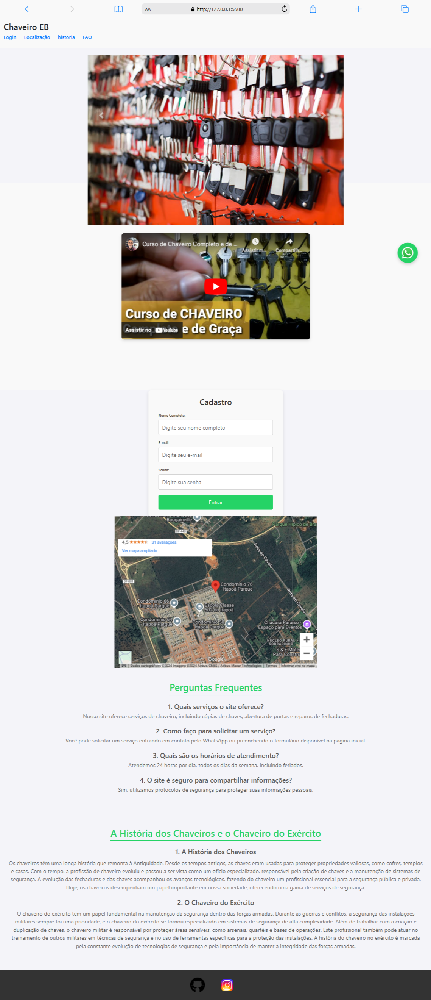

# Projeto Chaveiro EB

## Mockups

### Mobile
.png)

### Notebook

## Descrição do Projeto
O **Chaveiro EB** é um site desenvolvido para fornecer serviços de chaveiro online. O site oferece funcionalidades como a solicitação de serviços, informações sobre a história dos chaveiros, localização, FAQ, entre outros. A interface foi projetada de forma simples e intuitiva para proporcionar uma experiência de usuário agradável e fácil navegação.

---

## Paleta de Cores

| Cor            | Código Hexadecimal |  
| -------------- | ------------------ |
| **Aqua**       | #00FFFF            |
| **Verde**      | #25D366            |
| **Branco**     | #FFFFFF            |
| **Cinza Claro**| #F4F4F9            |
| **Cinza Escuro**| #333333           |
| **Preto**      | #000000            |
| **Marrom**     | #6F4F37            |

---

## Tipografia

- **Fonte Principal**: `Arial, sans-serif`
- **Fonte Secundária**: `Roboto, sans-serif`

A tipografia é simples e moderna, com foco na legibilidade e clareza do conteúdo.

---

## Lista de Tarefas do Projeto

1. **Estruturação HTML:**
   - Criar a estrutura semântica do site.
   - Adicionar seções como Home, FAQ, História, etc.

2. **Estilização CSS:**
   - Aplicar o design responsivo utilizando Flexbox e Grid.
   - Criar a paleta de cores e garantir que o design seja consistente.
   - Criar um botão fixo para o WhatsApp.

3. **Implementação de Funcionalidades:**
   - Inserir carrossel de imagens na página inicial.
   - Incorporar o vídeo do YouTube.
   - Criar um formulário de cadastro.

4. **Responsividade:**
   - Ajustar o layout para diferentes tamanhos de tela (Mobile e Desktop).

5. **Acessibilidade:**
   - Garantir que o site seja acessível para usuários com deficiência visual.

---

---

## Informações de Contato

- **Desenvolvedor**: Victor Elias Alves de Oliveira
- **Email**: jvitinhoalvesdeoliveira@gmail.com
- **LinkedIn**: [linkedin.com/in/joaosilva](https://www.linkedin.com/in/joaosilva)
- **GitHub**: [github.com/joaosilva](https://github.com/)

---

## Link de Acesso ao Site

O site pode ser acessado através do link:

[**Acessar o site Chaveiro EB**](http://www.chaveiroeb.com)

---

## Tecnologias Utilizadas

- **HTML5** - [Documentação Oficial](https://developer.mozilla.org/pt-BR/docs/Web/HTML)
- **CSS3** - [Documentação Oficial](https://developer.mozilla.org/pt-BR/docs/Web/CSS)
- **JavaScript** - [Documentação Oficial](https://developer.mozilla.org/pt-BR/docs/Web/JavaScript)
- **Bootstrap 4** - [Documentação Oficial](https://getbootstrap.com/)
- **jQuery** - [Documentação Oficial](https://jquery.com/)
- **FontAwesome** (Ícones) - [Documentação Oficial](https://fontawesome.com/)
- **Google Fonts** - [Documentação Oficial](https://fonts.google.com/)

---

## Licença

Esse projeto está licenciado sob a Licença MIT - veja o arquivo [LICENSE](LICENSE) para mais detalhes.

